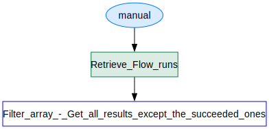

# Flow Documentation \- Fetchallpowerautomateruns\-DEC7F7F0\-49DB\-EF11\-8EEA\-6045BD08D9EE

| Flow Name                  | Fetchallpowerautomateruns\-DEC7F7F0\-49DB\-EF11\-8EEA\-6045BD08D9EE |
| -------------------------- | ------------------------------------------------------------------- |
| Flow Name                  | Fetchallpowerautomateruns\-DEC7F7F0\-49DB\-EF11\-8EEA\-6045BD08D9EE |
| Documentation generated at | 01 February 2025 05:27 PM                                           |
| Number of Variables        | 0                                                                   |
| Number of Actions          | 2                                                                   |

- [Overview](index-Fetchallpowerautomateruns-DEC7F7F0-49DB-EF11-8EEA-6045BD08D9EE.md)
- [Connection References](connections-Fetchallpowerautomateruns-DEC7F7F0-49DB-EF11-8EEA-6045BD08D9EE.md)
- [Variables](variables-Fetchallpowerautomateruns-DEC7F7F0-49DB-EF11-8EEA-6045BD08D9EE.md)
- [Triggers & Actions](triggersactions-Fetchallpowerautomateruns-DEC7F7F0-49DB-EF11-8EEA-6045BD08D9EE.md)

## Flow Overview

The following chart shows the top level layout of the Flow. For a detailed view, please visit the section called Detailed Flow Diagram

## Detailed Flow Diagram

The following chart shows the detailed layout of the Flow

